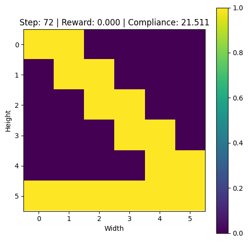
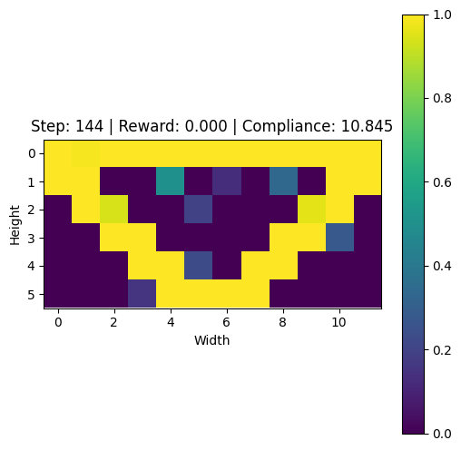

# Structural Optimization with PPO

This repository implements a reinforcement learning framework for the structural optimization of beams using Proximal Policy Optimization (PPO) with a CNN-based actor-critic architecture. The project leverages a custom environment, `BeamOptimizationEnv`, which simulates beam structures and computes rewards based on compliance, mass, and connectivity.

## Overview

The aim of this project is to optimize beam designs by minimizing compliance while ensuring structural integrity. Our approach utilizes a CNN-based PPO agent that generalizes across different beam configurations.

Below are two sample results from our experiments:

  
*Figure 1: An example of an optimized beam design.*

  
*Figure 2: A long beam configuration with improved performance metrics.*

## Repository Structure

- **mbb_cnn.py**: Defines the custom beam optimization environment that outputs a 5-channel image representing beam densities, normals, and forces.
- **ppo_cnn.py**: Contains the CNN-based PPO agent and actor-critic network.
- **train.py**: Script to train the PPO agent.
- **test.py**: Script for inference and evaluation of the trained agent.
- **src/images/**: Contains sample images (e.g., `image24.png` and `long_beam9.png`).

## Requirements

- Python 3.7+
- [PyTorch](https://pytorch.org/)
- [Gymnasium](https://www.gymlibrary.ml/)
- Other dependencies are listed in `requirements.txt`.

## Installation

Clone the repository and install the required packages:

```bash
git clone <repository_url>
cd structural_optimization
pip install -r requirements.txt
